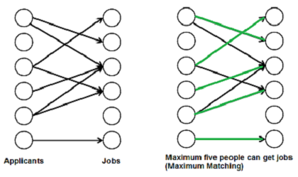

## Introduction

In this project, our primary goal was to replicate the behavior of the market as accurately as possible by creating an optimized stock composition. By leveraging real-world data, this project strives to construct a portfolio that reflects market movements and characteristics, making it as close to the real market as we could get. This is crucial for understanding market trends and refining decision-making processes that rely on up-to-date stock performance and interactions.

## Approach

The overall strategy of this project is to replicate the market by constructing a portfolio that reflects a 50/50 weighted average between the S&P 500 and TSX 60 sector compositions. The goal is to create a portfolio that is similarly diversified, with stock allocations determined by the market’s sector representation.

To achieve this, we first calculate a correlation coefficient for each stock within its sector using historical data from the past year. Stocks that demonstrate a higher correlation with the sector’s overall movement are assigned higher correlation coefficients.

Once these correlation coefficients are determined, a pairing algorithm is employed. This algorithm pairs sectors with the highest correlated stocks based on the computed coefficients, considering certain constraints. More formally, for each industry, **N** stocks are chosen, where **N** is calculated as a percentage of the sector’s weight in the respective index divided by two, multiplied by a constant, and floored (see driving code).

Additionally, to minimize non-systematic risk, the algorithm ensures that the portfolio maintains limited exposure to any single stock. This is accomplished by assigning each stock at most **M** times to (not necessarily distinct) sector, where **M** is optimized based on constants designed to balance diversification and risk management.

 ## Algorithm

 The core of our algorithm involves constructing a portfolio by selecting stocks based on their correlation with different sectors. We begin by calculating the correlation for each stock relative to the sectors, ensuring that each sector is represented by the best correlated stock(s). To minimize risk and maintain diversification, we use a [Bipartite Matching Algorithm](https://www.geeksforgeeks.org/maximum-bipartite-matching/), a graph theory approach, to cap each stock while maximizing the correlation sum in the resulting portfolio.

 
 This algorithm runs in 
**O(VE)**, where 
**V** represents the total number of sectors and stocks, and 
**E** is the product of sectors and stocks. Additionally, we optimize the stock weights using binary search to ensure the portfolio contains no more than 24 stocks while adhering to diversification constraints. For sectors with insufficient market representation, we assign a stock that is best correlated within the portfolio. The process includes adjusting sector caps, calculating the optimal unit percentage, and ensuring each stock is assigned to the sector it correlates with most strongly.

## Result

### Portfolio vs Market Performance

Over the past year, our portfolio closely tracked the market. The portfolio error relative to the market was **0.9993**, indicating a very small deviation from the weighted index. This suggests the portfolio performed almost identically to the market during this period.

### Correlation & Beta Portfolios
We compared portfolios constructed using correlation and beta as metrics:

Correlation Portfolio:

Error relative to market: **0.9993**  
Standard deviation: **0.0097**  
The correlation-based portfolio showed a minimal error and lower volatility, suggesting a stable performance aligned with the market.

Beta Portfolio:

Error relative to market: **1.4792**  
Standard deviation: **0.0118**  
The beta-based portfolio had a significantly higher error and greater volatility, meaning it did not track the market as closely.
